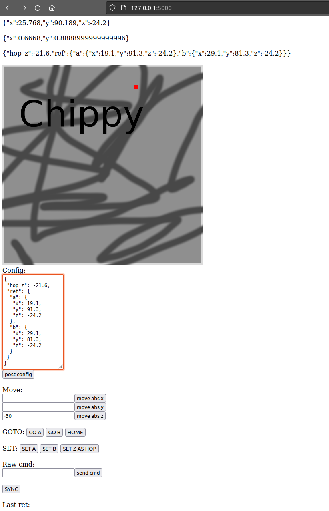

My hacky Flask based server to control and monitor a Genmitsu 3018-PROVer. 

- Install requirements from `requirements.txt`.
- Run with `python main.py`.
- Open `127.0.0.1:5000`.

Example of talking over HTTP from python:

```
# Set up hopping and two reference points

xy_url = 'http://127.0.0.1:5000'
xy_session = Session()
xy_config = {
 "hop_z": -21.6,
 "ref": {
  "a": {
   "x": 19.1,
   "y": 91.3,
   "z": -24.2
  },
  "b": {
   "x": 29.1,
   "y": 81.3,
   "z": -24.2
  }
 }
}
xy_session.post(xy_url + '/config', json=xy_config)
```

```
# Make it move in one or more axis (include or exclude from json) to an absolute position (handler in the server takes care of hopping, if configured)

xy_session.post(xy_url + '/move', json={'x': params.xy_scanner0, 'y': params.xy_scanner1})
```

Beautiful monitoring UI:



Controlling this badboy:


